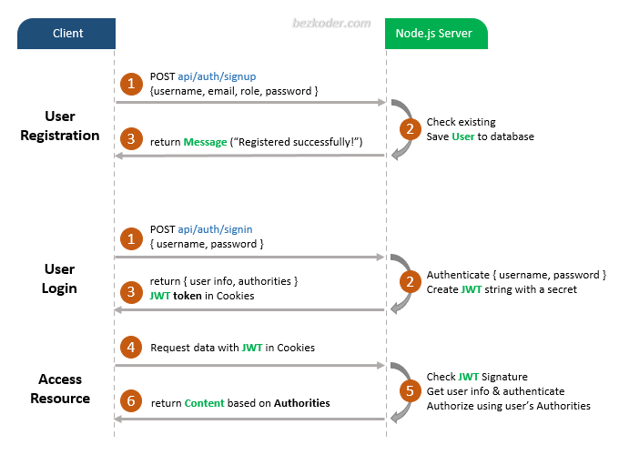

# Node.js Express Login and Registration example with JWT

- Appropriate Flow for User Login and Registration with JWT Authentication
- Node.js Express Architecture with CORS, Authentication & Authorization middlewares & Sequelize
- How to configure Express routes to work with JWT
- How to define Data Models and association for Authentication and Authorization
- Way to use Sequelize to interact with MySQL Database

## User Registration, User Login and Authorization process.
The diagram shows flow of how we implement User Registration, User Login and Authorization process.



For more detail, please visit:
> [Node.js Express Login and Registration example with JWT](https://www.bezkoder.com/node-js-express-login-example/)

## More Practice:
> [Build Node.js Rest APIs with Express, Sequelize & MySQL](https://www.bezkoder.com/node-js-express-sequelize-mysql/)

> [Server side Pagination in Node.js with Sequelize and MySQL](https://www.bezkoder.com/node-js-sequelize-pagination-mysql/)

> [Node.js Express File Upload Rest API example](https://www.bezkoder.com/node-js-express-file-upload/)

> [Node.js Express File Upload with Google Cloud Storage example](https://www.bezkoder.com/google-cloud-storage-nodejs-upload-file/)

> [Node.js JWT Authentication & Authorization example (using HTTP Headers)](https://www.bezkoder.com/node-js-jwt-authentication-mysql/)

> [Node.js JWT Authentication & Authorization example with MongoDB](https://www.bezkoder.com/node-js-mongodb-auth-jwt/)

Associations:
> [Sequelize Associations: One-to-Many Relationship example](https://www.bezkoder.com/sequelize-associate-one-to-many/)

> [Sequelize Associations: Many-to-Many Relationship example](https://www.bezkoder.com/sequelize-associate-many-to-many/)

Deployment:
> [Deploying/Hosting Node.js app on Heroku with MySQL database](https://www.bezkoder.com/deploy-node-js-app-heroku-cleardb-mysql/)

Integration on same Server/Port:
> [Integrate Angular 8 with Node.js Express](https://www.bezkoder.com/integrate-angular-8-node-js/)

> [Integrate Angular 10 with Node.js Express](https://www.bezkoder.com/integrate-angular-10-node-js/)

> [Integrate Angular 12 with Node.js Express](https://www.bezkoder.com/integrate-angular-12-node-js/)

> [Integrate Vue with Node.js Express](https://www.bezkoder.com/serve-vue-app-express/)

> [Integrate React with Node.js Express](https://www.bezkoder.com/integrate-react-express-same-server-port/)

## Project setup
```
npm install
```

### Run
```
node server.js
```
